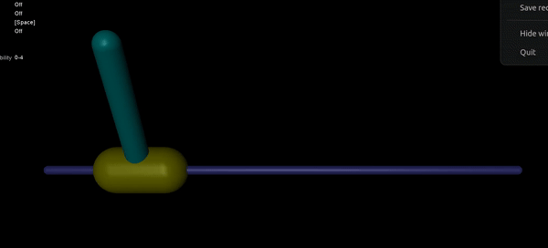

# Cartpole using REINFORCE 
Implementation the REINFORCE algorithm, a classic policy gradient method, to solve the CartPole problem. Policy is trained in **Cartpole-v4 in Open-AI Gymnasium environment** using **Mujoco** and tested in **Gazebo-Classic and Mujoco**.

# Dependecies
- [ROS2 HUMBLE](https://docs.ros.org/en/humble/Installation.html)
- [Gazebo Classic](https://classic.gazebosim.org/tutorials?tut=install_ubuntu)
- ROS2 Control:
  ```
  sudo apt install ros-humble-ros2-control
  ```
- Gazebo ROS2 Control Demos:
  ```
  sudo apt install ros-humble-gazebo-ros2-control
  sudo apt install ros-humble-gazebo-ros2-control-demos
  ```

# Execution

## Running main loop
```
python3 src/main.py
```

## Training custom policy in Mujoco
```
ros2 service call /init std_srvs/srv/Empty 
```
## Testing policy in Mujoco
```
ros2 service call /start std_srvs/srv/Empty
```
## Testing policy in Gazebo
```
ros2 service call /start_gazebo std_srvs/srv/Empty
```

## Results
<div align='center'>
  


</div>

